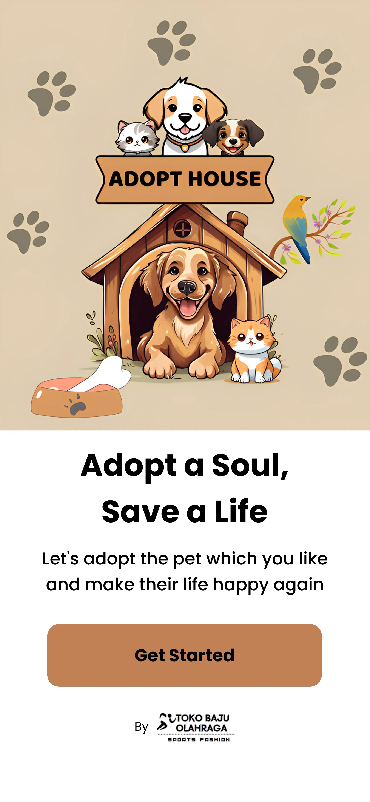

# Portfolio of Agung Maulana Saputra

Welcome to the portfolio project of Agung Maulana Saputra, a passionate Full Stack Developer with expertise in modern web technologies.

## About Me

I am a dedicated and versatile full stack developer with 5 years of professional experience. I specialize in creating efficient and user-friendly web applications using technologies such as React, Next.js, Node.js, MySQL, PostgreSQL, and MongoDB.

## Portfolio Overview

This portfolio showcases my projects, skills, and professional experience. It is built with React and styled using Tailwind CSS, featuring smooth animations powered by Framer Motion.

### Key Sections

- **Navbar**: Navigation with social media links.
- **Hero Section**: Introduction with profile picture and a brief about me.
- **Technologies**: Highlights of the main technologies I work with.
- **Experience**: Professional work experience and roles.
- **Projects**: A showcase of selected projects with descriptions and technologies used.

## Assets

Profile Picture:

Logo:

Project Images:

- 
- 
- 

## How to Run

1. Clone the repository.
2. Install dependencies using `npm install`.
3. Run the development server with `npm run dev`.
4. Open the app in your browser at `http://localhost:3000`.

## Contact

You can reach me at:

- Email: me@example.com
- Phone: +12 4555 666 00
- Address: 767 Fifth Avenue, New York, NY 10153

---

Thank you for visiting my portfolio!
